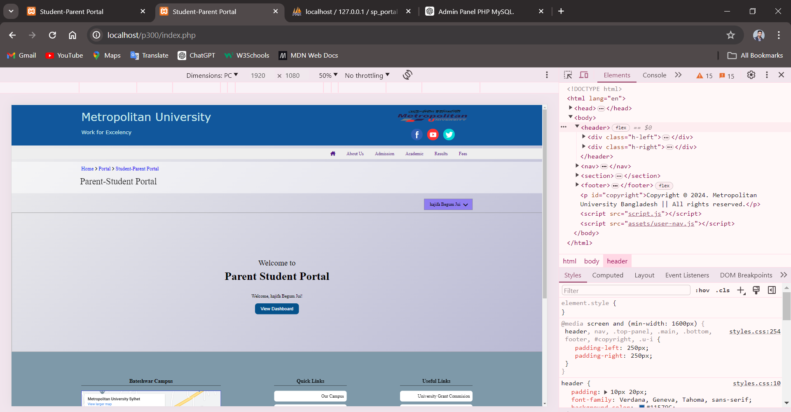

# **Student-Parent Portal**

----------------------------------------*Project 300*-------------------------------------

## Project Overview

**Project Name:** Student-Parent Portal  
**Course:** Project 300 | Metropolitan University  

**Description:**  
Providing a digital and fast platform for students to stay in touch with the university, and opportunities for guardians to monitor the academic activities of their child.

**Project Team:**  
- **Design:** Hajifa Begum Jui  
- **Front-end Development:** Rayhan Ahmed and Hajifa  
- **Back-end Development:** Nayem Ahmed  
- **Guide:** Special thanks to our guide Muhtasim sir and Naeem Sir

**Timeline:**  
- **Initialized:** 17 April 2024 at 00:48  
- **Completed:** 22 May 2024 at 11:45

## Table of Contents

- [Overview](#overview)
- [Full Details of Project](#full-details-of-project)
  - [Project Title](#project-title)
  - [Group Members](#group-members)
  - [Objective](#objective)
  - [Features](#features)
  - [Relation to University](#relation-to-university)
- [Technologies Used](#technologies-used)
- [Installation and Setup](#installation-and-setup)
- [Usage](#usage)
- [Screenshots](#screenshots)
- [Contributing](#contributing)
- [License](#license)
- [Contact](#contact)

## Overview
The Student-Parent Portal is a web-based application designed to facilitate communication between students, parents, and the school. It provides features such as result viewing, tuition fee tracking, and more. This project focuses on enhancing the educational experience by providing easy access to important information.

## Full Details of Project
### Project Title
**Student-Parent Portal**

### Group Members
1. **Nayem Ahmed** - 003
2. **Hajifa Begum Jui** - 013
3. **Rayhan Ahmed** - 025

### Objective
We aim to build a system where students can track their academic records such as results, and see the status of various fees such as semester fees and monthly tuition fees, which will be shown as due, paid, and so on. Additionally, guardians of the students can also check the results and fee payment statuses. Users will not need to wait for weeks to get their result status, as our system will fetch results in a very short time.

### Features
1. **User Registration and Login**: Both parents and students can sign up and sign in. Registered users may have additional benefits such as access to the notice board, academic calendar, upcoming events, etc.
2. **Result Checking**: Users can check results within a few moments.
3. **Fee Tracking**: Users can track the payment status for monthly tuition fees and semester fees.

### Relation to University
At Metropolitan University, students currently have to send an email to Onestop for their results and wait until the results are manually checked and sent back. Additionally, students don't have access to check their payment status and must go to the account section to ask the accountant for any dues or payment status. Our Student-Parent Portal will automate these processes, allowing users to easily get their results and fee payment statuses by providing their student information.

_Last edited on 22 May 2024

## Technologies Used
- **Frontend:** HTML, CSS, JavaScript
- **Backend:** PHP
- **Database:** MySQL
- **Authentication:** PHP Sessions
- **Hosting:** Apache

## Installation and Setup
1. **Clone the repository**:
    ```bash
    git clone https://github.com/your-username/student-parent-portal.git
    cd student-parent-portal
    ```

2. **Install dependencies**:
    Ensure you have PHP and MySQL installed on your system. You can use XAMPP, WAMP, or any other LAMP stack solution.

3. **Configure the database**:
    - Create a MySQL database.
    - Import the `database.sql` file provided in the repository to set up the tables.
    - Update the database configuration in `config.php` with your database credentials:
    ```php
    <?php
    define('DB_SERVER', 'localhost');
    define('DB_USERNAME', 'your_username');
    define('DB_PASSWORD', 'your_password');
    define('DB_NAME', 'your_database_name');
    ?>
    ```

4. **Start the server**:
    - If using XAMPP, start Apache and MySQL from the XAMPP control panel.
    - Place the project folder in the `htdocs` directory (for XAMPP) or your web server's root directory.

5. **Visit the application**:
    Open your browser and go to `http://localhost/student-parent-portal`

## Usage
- **Sign Up**: Users can sign up by providing their details.
- **Sign In**: Existing users can log in using their credentials.
- **Parent/Guardian Form**: Parents/Guardians can fill out a form to check their child's results and track tuition fees.
- **Student Dashboard**: Logged-in students can view their results and track tuition fees directly.

## Screenshots
### Home


### Footer


### Sign Up Form


### Parent/Guardian Form


### Succesfully Sign up


### User Dashboard


### Parent/Results


### Responsible for smaller screen (Mobile)


### Responsible for large screen (Desktop PC)


## Contributing
1. **Fork the repository**
2. **Create a new branch**:
    ```bash
    git checkout -b feature-branch
    ```
3. **Make your changes**
4. **Commit your changes**:
    ```bash
    git commit -m "Add your message here"
    ```
5. **Push to the branch**:
    ```bash
    git push origin feature-branch
    ```
6. **Create a Pull Request**: Go to the repository on GitHub and create a pull request.

## License
This project is licensed under the MU License. See the [LICENSE](LICENSE) file for details.

## Contact
If you have any questions or suggestions, feel free to open an issue or contact the project maintainers.

---

Thank you for using the Student-Parent Portal! We hope it enhances your educational experience.